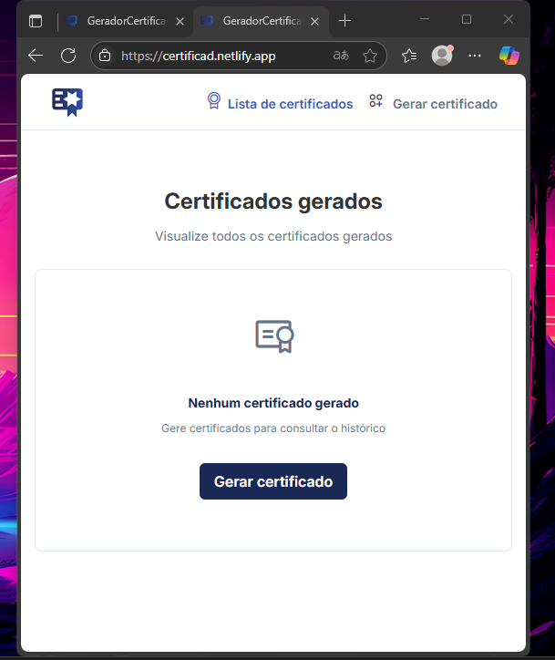

# Gerador de Certificados
## 💻 [Acessar o site](https://certificad.netlify.app/)
  

 Projeto feito a partir aulas da Rockeseat para o desenvolvimento de novos conhecimento em Angular.

  

## 🚀 Tecnologias
Esse projeto foi desenvolvido com as seguintes tecnologias:
- CSS
- Bootstrap
- Angular
- Git

 Feito por Giovanna Kethleen ♥ 

